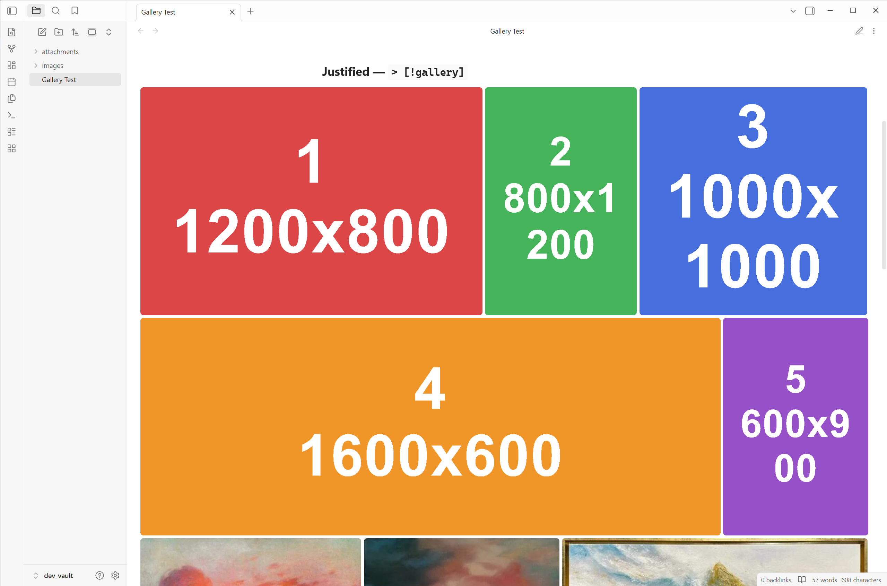

# Media Gallery

**English** · [Русский](README.ru.md)

An Obsidian plugin that turns callouts into image galleries in reading view — **without cropping**. Mixed portrait and landscape photos sit side by side, each shown in full.

 



## Features

- **`[!gallery]` — justified rows.** Widths are computed in JavaScript proportionally to each image's aspect ratio, so every row fills the width edge-to-edge while nothing is stretched or cropped (like Google Photos / Flickr).
- **`[!gallery-masonry]` — masonry columns.** Pinterest-style columns; every image is shown in full at its natural height.
- **No cropping.** Portrait and landscape mix freely.
- **Reflows** on pane resize and as images load.
- **Wider than the text column** — the gallery breaks out beyond the readable line width (configurable).
- **Lightbox-friendly** — pairs with the [Image Viewer](https://github.com/Fan4Metal/obsidian_image_viewer) plugin for click-to-zoom.

## Usage

Wrap your embeds in a callout and drop images inside. Blank lines between images don't matter.

```markdown
> [!gallery]
> ![[photo-1.png]]
> ![[photo-2.png]]
> ![[photo-3.png]]
> ![[photo-4.png]]
```

Masonry variant:

```markdown
> [!gallery-masonry]
> ![[photo-1.png]]
> ![[photo-2.png]]
> ![[photo-3.png]]
```

> **Tip:** for a single image, just embed it normally (outside a callout) — galleries are for groups.

### Quick-wrap command

Instead of typing the callout by hand, select the image lines and run a command:

- **Media Gallery: Wrap selection in gallery callout**
- **Media Gallery: Wrap selection in masonry gallery callout**
- **Media Gallery: Remove gallery callout wrapping**

Open the command palette (`Ctrl/Cmd+P`) and run one, or assign a hotkey in **Settings → Hotkeys**. Each selected line gets a `> ` prefix and a `> [!gallery]` header is added on top. With no selection, it wraps the current line.

> **Adding to an existing gallery.** If the selection includes lines that already belong to a gallery, the new lines are merged into it (they just get a `> ` prefix) — no second header is added, so you never get a nested gallery. The type is taken from the existing header. A fresh `> [!gallery]` is only created when the selection does *not* touch another gallery's lines.

**Unwrap** removes the `[!gallery]` header and strips one level of `> ` — use a selection, or just place the cursor inside the callout and it detects the block automatically.

There is also a **ribbon button** (left sidebar, grid icon): select your image lines, click it, and pick *Justified*, *Masonry*, or *Remove gallery*. Toggle it off in **Settings → Media Gallery → Ribbon button**.

## Settings

Open **Settings → Media Gallery**:

| Setting | What it does | Default |
| --- | --- | --- |
| Row height (justified) | Target row height for `[!gallery]` | 220 px |
| Columns (masonry) | Column count for `[!gallery-masonry]` | 3 |
| Gap | Space between items | 7 px |
| Border radius | Corner radius of images/videos | 6 px |
| Gallery width | Width relative to the text column (needs *Readable line length* on) | 140% |

## How the justified layout works

Images are grouped greedily into rows: items are added until their combined width at the target height would overflow the container, then the whole row is scaled so its widths — each proportional to the image's aspect ratio — fill the row exactly. Because width equals `aspectRatio × height`, every image keeps its true proportions: no `object-fit: cover`, no cropping. The last, incomplete row keeps the target height and is left-aligned.

## Requirements

- Works in **reading view**.
- **Gallery width > 100%** requires *Settings → Editor → Readable line length* to be enabled.

## Installation

The plugin is not in the community store yet, so install it manually:

1. Download the three plugin files: `manifest.json`, `main.js`, `styles.css` (from this repository's `plugin/` folder, or a release).
2. In your vault, create the folder `<your-vault>/.obsidian/plugins/media-gallery/`.
3. Copy the three files into that folder.
4. In Obsidian, open **Settings → Community plugins**. If *Restricted mode* is on, turn it off.
5. Click **Reload plugins** (or restart Obsidian), then find **Media Gallery** in the list and enable it.
6. *(Recommended)* Enable **Settings → Editor → Readable line length** so galleries can be wider than the text column.

> **Note:** `.obsidian` is a hidden folder. Enable "show hidden files" in your file manager, or open it via **Settings → About → Open vault folder** in Obsidian, then navigate into `.obsidian/plugins`.

## Development

The plugin sources live in the `plugin/` folder. A local `dev_vault/` (not committed) is used for testing.

```powershell
# copies plugin/* into dev_vault and enables it
./deploy.ps1

# re-deploy automatically on every change
./deploy.ps1 -Watch

# deploy to another vault
./deploy.ps1 -Vault "C:\Path\To\Vault"
```

After deploying, reload Obsidian (`Ctrl+P → Reload app without saving`) and enable **Media Gallery** under *Settings → Community plugins*.

## Project layout

| Path | Purpose |
| --- | --- |
| `plugin/manifest.json` | Plugin manifest |
| `plugin/main.js` | Post-processor + justified layout algorithm |
| `plugin/styles.css` | Callout chrome, width breakout, masonry |
| `deploy.ps1` | Copies the plugin into a vault; `-Watch` mode |
| `dev_vault/` | Test vault with sample images and notes |

## License

MIT
